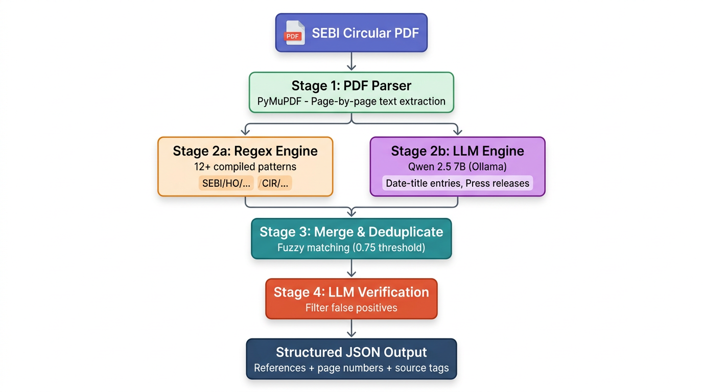
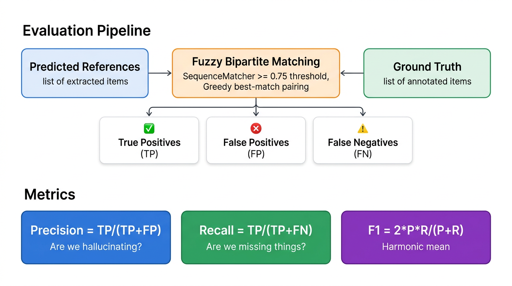
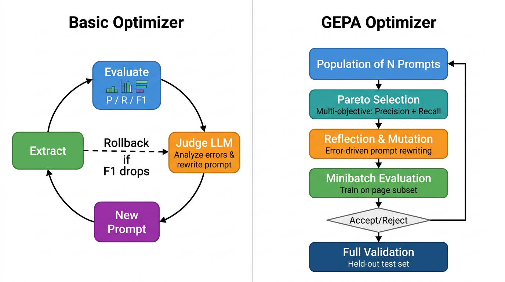

# SEBI Circular Reference Extractor

A hybrid **Regex + LLM** pipeline that extracts every cross-reference from SEBI (Securities and Exchange Board of India) circular PDFs — circulars, regulations, acts, gazette notifications, press releases, letters, and emails. Built for compliance teams at Indian financial institutions who need to track SEBI's evolving regulatory landscape.

---

## Table of Contents

- [Problem Statement](#problem-statement)
- [Solution Overview](#solution-overview)
- [Pipeline Architecture](#pipeline-architecture)
  - [Stage 1 — PDF Parsing](#stage-1--pdf-parsing)
  - [Stage 2a — Regex Extraction (Fast Pass)](#stage-2a--regex-extraction-fast-pass)
  - [Stage 2b — LLM Extraction (Deep Pass)](#stage-2b--llm-extraction-deep-pass)
  - [Stage 3 — Merge & Deduplicate](#stage-3--merge--deduplicate)
  - [Stage 4 — LLM Verification](#stage-4--llm-verification)
- [Results & Performance](#results--performance)
- [Evaluation Framework](#evaluation-framework)
- [Prompt Optimization](#prompt-optimization)
  - [Basic Iterative Optimizer](#basic-iterative-optimizer)
  - [GEPA — Genetic-Evolutionary Prompt Architecture](#gepa--genetic-evolutionary-prompt-architecture)
- [How to Run](#how-to-run)
- [Project Structure](#project-structure)
- [Reference Types Detected](#reference-types-detected)
- [Output Format](#output-format)
- [Tech Stack](#tech-stack)
- [Limitations & Future Work](#limitations--future-work)
- [Note on Model Choice](#note-on-model-choice)

---

## Problem Statement

SEBI circulars frequently reference other circulars, regulations, and laws. A single master circular can reference **400+ other documents** across dozens of formatting styles. Since these documents are all PDFs, manually tracking cross-references across hundreds of documents is time-consuming and error-prone.

Compliance teams need to:
- Identify every document referenced in a new circular
- Map dependencies between regulatory documents
- Track which circulars supersede or amend earlier ones

Doing this manually for a 13-page master circular with 400+ references would take hours. This tool does it in minutes.

---

## Solution Overview

The system uses a **4-stage hybrid pipeline** that combines fast regex pattern matching with LLM-powered extraction to achieve comprehensive reference detection that neither method could accomplish alone.

The key insight: regex is fast and precise for structured reference formats (like `SEBI/HO/MRD/.../CIR/2024/65`), but it completely misses informal references (like `"SEBI letter dated January 5, 2023"` or date-title entries in numbered lists). An LLM catches those, but it's slower and can hallucinate. By running both and merging intelligently, we get the best of both worlds.

---

## Pipeline Architecture



### Stage 1 — PDF Parsing

Uses **PyMuPDF** (`fitz`) to extract text from each page independently. This preserves page-level granularity so every reference can be traced back to its exact page number(s).

```python
pages = extract_text_by_page("circular.pdf")
# Returns: [{"page_num": 1, "text": "..."}, {"page_num": 2, "text": "..."}, ...]
```

### Stage 2a — Regex Extraction (Fast Pass)

Applies **12+ compiled regex patterns** against each page's text. This catches all structured reference formats used by SEBI. The patterns are carefully crafted to cover the wide variety of SEBI circular numbering schemes used across decades:

| Pattern Category | What It Catches | Example |
|------------------|----------------|---------|
| New-format SEBI circulars | `SEBI/HO/.../CIR/YYYY/N` | `SEBI/HO/MRD/MRD-PoD-3/P/CIR/2024/65` |
| Older CIR format | `CIR/.../N/YYYY` | `CIR/MRD/DP/13/2010` |
| Department-prefixed | `IMD/MRD/MIRSD...` variants | `MRD/DP/14/2010` |
| Master Circulars | `Master Circular No. ...` | `Master Circular No. CIR/CFD/...` |
| SEBI Regulations | `SEBI (...) Regulations, YYYY` | `SEBI (LODR) Regulations, 2015` |
| Indian Acts | Various `... Act, YYYY` patterns | `Companies Act, 2013` |
| Section references | `Section/Regulation X of ...` | `Section 11(1) of the SEBI Act` |
| Gazette notifications | `Gazette of India...` | `Gazette of India, Part III` |
| Generic dated circulars | `Circular/Letter No. ... dated ...` | `Circular No. SMD/... dated March 14, 1995` |

Each match is deduplicated by normalized title and tagged with its source pages. The regex pass is deterministic, free, and completes in milliseconds.

### Stage 2b — LLM Extraction (Deep Pass)

Pages are sent to a local **Qwen 2.5 7B** model (via Ollama's OpenAI-compatible API) in **batches of 3 pages** with a specialized extraction prompt. The LLM is told what regex already found and asked to find only **additional** references that regex missed.

The LLM is specifically tuned to catch:

1. **Date-title entries in numbered lists** — the most commonly missed format:
   ```
   39 Oct 27, 2010- European Style Stock Options
   67 December 05, 2013 - Exchange Traded Cash Settled Interest Rate Futures
   ```

2. **Ref. No. format references**:
   ```
   Ref. No. DNPD/Cir-23/04 dated April 27, 2004
   Ref. SMD/6059 dated October 17, 1994
   ```

3. **Letters and emails**:
   ```
   SEBI letter dated January 5, 2023
   SEBI Email dated May 4, 2020 on Rationalisation of Strikes
   ```

4. **Press releases**:
   ```
   Press Release No. 49/2018 dated December 03, 2018
   ```

5. **Non-standard circular prefixes** (SMD, SMDRP, DNPD, etc.):
   ```
   Circular No. SMD/536/95 dated March 28, 1995
   ```

The prompt includes 7 few-shot examples targeting these specific patterns. A 1-second delay between batches prevents overloading the local model.

### Stage 3 — Merge & Deduplicate

The merge process works in three steps:

1. **Combine**: Start with all regex results as the baseline. For each LLM result, check if it duplicates an existing entry using fuzzy matching (`difflib.SequenceMatcher` with a **0.75 similarity threshold**). If it's a duplicate, mark the existing entry as found by `"both"` methods and merge page numbers. If it's new, add it with source `"llm"`.

2. **LLM-powered deduplication**: Cluster near-duplicate references (where one title is a strict substring of another) and use the LLM to pick the most complete canonical form. For example, `"MRD/DP/14/2010"` and `"Circular No. MRD/DP/14/2010 dated April 26, 2010"` get merged into the longer, more complete form.

3. **Sort** by first page number of appearance.

### Stage 4 — LLM Verification

A final verification pass sends references in batches of 30 to the LLM, asking it to filter out false positives:
- Internal section headings mistaken for references
- Bare department codes without circular context
- Page numbers or index entries
- Generic descriptions that aren't specific document references

A safety check ensures the verification isn't too aggressive — if it removes more than 50% of references, the filter is skipped entirely.

---

## Results & Performance

### Benchmark: 13-page SEBI Master Circular (Schedule I — Stock Exchanges)

| Metric | v1 Run | v2 Run |
|--------|:------:|:------:|
| **Total references found** | **477** | **463** |
| Regex only | 326 | 334 |
| LLM only | 95 | 81 |
| Both (confirmed by both) | 56 | 48 |
| **Total regex hits** (regex + both) | 382 | 382 |
| **Total LLM hits** (llm + both) | 151 | 129 |

**Key takeaways:**

- **Regex does the heavy lifting** — consistently finding 382 references across both runs
- **LLM adds 80–95 extra references** that regex simply cannot catch (informal citations, date-based list entries, letters/emails)
- The hybrid approach found **25% more references** than regex alone
- The overlap ("both") confirms ~50 references were independently validated by both methods

### What the LLM Added (references regex missed)

| Category | Count | Example |
|----------|:-----:|---------|
| Non-standard circular formats | ~83 | `Ref.No. DNPD/Cir-24/04 dated May 26, 2004` |
| Letters & informal refs | ~7 | `Letter dated September 02, 2002` |
| SEBI emails | ~3 | `SEBI Email dated May 4, 2020` |
| Press releases | ~2 | `Press Release No. 49/2018 dated December 03, 2018` |

---

## Evaluation Framework



The project includes a built-in evaluation framework (`evaluate.py`) to measure extraction quality using standard information retrieval metrics.

### How It Works

1. **Ground truth**: A manually annotated JSON file listing all known references in the PDF (a sample `ground_truth_sample.json` with 42 references is included)

2. **Fuzzy bipartite matching**: Predicted references are matched to ground truth using a greedy best-match approach:
   - Compute pairwise similarity scores between all predicted and ground truth titles
   - Process pairs in **descending order of similarity** (best matches first)
   - This prevents fragments from "stealing" ground truth slots that have a near-perfect full-form match
   - Similarity threshold: **0.75** (via `SequenceMatcher`)
   - Substring containment of meaningful identifiers (>10 chars) counts as a strong match

3. **Metrics computed**:

   | Metric | Formula | What It Measures |
   |--------|---------|-----------------|
   | **Precision** | TP / (TP + FP) | Are we hallucinating? |
   | **Recall** | TP / (TP + FN) | Are we missing things? |
   | **F1 Score** | 2 × P × R / (P + R) | Harmonic mean — overall quality |

4. **Comparison output**: Side-by-side table showing regex-only vs hybrid metrics, plus detailed lists of what the LLM uniquely added and what was missed by both methods

### Sample Evaluation Output

```
============================================================
RESULTS
============================================================
Method                Precision     Recall         F1    Found
------------------------------------------------------------
Regex-only                0.110      1.000      0.198      382
Hybrid (regex+LLM)        0.088      1.000      0.162      477
------------------------------------------------------------
Improvement              -0.022     +0.000     -0.036
```

> **Note**: The low precision and high recall here is because the ground truth sample contains only 42 of the 400+ actual references. With a complete ground truth annotation, precision would be significantly higher.

---

## Prompt Optimization

We built two prompt optimization systems to automatically improve the LLM extraction prompt using a feedback loop. Both treat the extraction prompt as a "program" to optimize — instead of a human manually tweaking the prompt based on errors, the LLM sees its own mistakes and rewrites its own instructions.



### Basic Iterative Optimizer

**File**: `optimize.py`

The simpler approach follows an **extract → evaluate → rewrite** loop:

**The Loop (N iterations):**

1. **Extract** — Run the current LLM prompt on all pages, merge with regex results
2. **Evaluate** — Compare against ground truth, compute precision/recall/F1, and identify:
   - **Missed references** (false negatives — things it should have found)
   - **False positives** (things it hallucinated)
   - **Correct matches** (for context)
3. **Judge LLM rewrites the prompt** — A "judge" (the same Qwen 2.5 7B model) receives:
   - The current prompt
   - P/R/F1 scores
   - Up to 20 missed references
   - Up to 15 false positives
   - 10 correctly found examples
   
   It analyzes error patterns and writes a **completely new extraction prompt** with improved instructions and targeted few-shot examples.
4. **Validate** — If F1 improves, keep the new prompt. If F1 regresses, **rollback** to the best prompt seen so far.

**Key safeguard**: The optimizer tracks the best F1 ever seen. If an iteration makes things worse, it reverts rather than spiraling downward.

**How to run:**
```bash
python main.py optimize path/to/circular.pdf ground_truth.json --iterations 3
```

### GEPA — Genetic-Evolutionary Prompt Architecture

**File**: `gepa_optimize.py`

GEPA is a more sophisticated, population-based optimization approach inspired by evolutionary algorithms. Instead of improving a single prompt, it evolves a **population of diverse prompt candidates** simultaneously.

#### How GEPA Works

**Phase 1 — Seeding:**
- Start with the original hand-tuned prompt as the seed
- Generate initial population through mutations of the seed (each mutation is an LLM-driven rewrite targeting the seed's error patterns)

**Phase 2 — Evolution Loop (N iterations):**

1. **Pareto Selection** — Select a parent from the **Pareto front** — the set of prompts that are not dominated by any other on both precision AND recall simultaneously. This explores the precision-recall trade-off space rather than collapsing to a single metric.

2. **Reflection & Mutation** — The LLM examines the parent's **execution trace** (what it missed, what it hallucinated, what it got right) and generates an improved child prompt. This is targeted, error-driven rewriting — not random mutation.

3. **Minibatch Evaluation** — The child is evaluated on a **random subset** of training pages (not the full document), making each iteration faster.

4. **Accept/Reject** — The child is accepted into the population if its F1 is at least **95% of the parent's F1** on the same minibatch. This allows slight regressions that might lead to better exploration.

5. **Pruning** — If the population exceeds 2× target size, prune by keeping the Pareto front + best-by-F1.

**Phase 3 — Validation:**
- All Pareto-optimal candidates are evaluated on the **held-out validation set** (30% of pages not used during training)
- The best candidate on validation wins, but only if it actually beats the original seed prompt
- Otherwise, the optimizer concludes the original was already optimal

#### GEPA vs Basic Optimizer

| Feature | Basic Optimizer | GEPA |
|---------|----------------|------|
| **Strategy** | Single prompt, iterative rewrite | Population of prompts, evolved |
| **Selection** | Best F1 wins | Pareto front (precision vs recall) |
| **Evaluation** | All pages every iteration | Minibatch training + held-out validation |
| **Overfitting guard** | Rollback only | Train/validation split (70/30) |
| **Diversity** | One prompt at a time | Multiple prompts exploring different trade-offs |
| **Exploration** | Greedy (only accepts improvements) | Allows 5% regression for better exploration |

#### GEPA Status

> **Note**: We were unable to fully run GEPA at scale because it requires a large number of LLM calls (population × iterations × pages-per-evaluation), and even with a local model via Ollama, the sequential nature of the calls made full runs extremely time-consuming. With a cloud API, rate limits would be even more restrictive. The architecture is complete and functional — it just needs either a faster local model, a batched inference endpoint, or sufficient API quota to run to completion.

**How to run:**
```bash
python main.py gepa path/to/circular.pdf ground_truth.json --iterations 5 --population 4
```

---

## How to Run

### Prerequisites

- **Python 3.10+**
- **Ollama** — for running the local LLM

### Step 1: Install Ollama and pull the model

```bash
# Install Ollama (macOS)
brew install ollama

# Or download from https://ollama.com

# Start the Ollama server
ollama serve

# Pull the Qwen 2.5 7B model (in a new terminal)
ollama pull qwen2.5:7b
```

### Step 2: Clone and install dependencies

```bash
git clone https://github.com/ALPHAGOD12/hyde.git
cd hyde
python -m venv .venv
source .venv/bin/activate  # On Windows: .venv\Scripts\activate
pip install -r requirements.txt
```

### Step 3: Run extraction

```bash
# Basic extraction (prints to console)
python main.py extract path/to/circular.pdf

# Save results to JSON
python main.py extract path/to/circular.pdf --output results.json
```

### Step 4: Run evaluation (optional)

```bash
# Evaluate against ground truth
python main.py evaluate path/to/circular.pdf ground_truth_sample.json
```

### Step 5: Run prompt optimization (optional)

```bash
# Basic iterative optimizer (2 iterations)
python main.py optimize path/to/circular.pdf ground_truth_sample.json --iterations 2

# GEPA evolutionary optimizer (5 iterations, population of 4)
python main.py gepa path/to/circular.pdf ground_truth_sample.json --iterations 5 --population 4
```

### All Available Commands

| Command | Description | Example |
|---------|------------|---------|
| `extract` | Extract references from a PDF | `python main.py extract circular.pdf -o results.json` |
| `evaluate` | Compare extraction against ground truth | `python main.py evaluate circular.pdf gt.json` |
| `optimize` | Iterative prompt optimization | `python main.py optimize circular.pdf gt.json -n 3` |
| `gepa` | GEPA evolutionary optimization | `python main.py gepa circular.pdf gt.json -n 5 -p 4` |

---

## Project Structure

```
hyde/
├── main.py                    # CLI entry point (extract / evaluate / optimize / gepa)
├── extract.py                 # Core engine: PDF parsing, regex patterns, LLM extraction,
│                              #   merge, deduplication, and verification
├── evaluate.py                # Evaluation framework: fuzzy matching, P/R/F1 computation,
│                              #   regex-only vs hybrid comparison
├── optimize.py                # Basic iterative prompt optimizer (judge LLM rewriting)
├── gepa_optimize.py           # GEPA evolutionary prompt optimizer (population-based,
│                              #   Pareto selection, train/val split)
├── requirements.txt           # Python dependencies
├── ground_truth_sample.json   # 42 manually annotated references for evaluation
├── results.json               # Extraction results (v1 run)
├── results_v2.json            # Extraction results (v2 run)
├── docs/
│   ├── pipeline_architecture.png    # Architecture diagram
│   ├── optimization_flow.png        # Optimization flow diagram
│   └── evaluation_framework.png     # Evaluation framework diagram
├── .env                       # Local config (git-ignored)
└── .gitignore
```

---

## Reference Types Detected

| Type | Description | Examples |
|------|-------------|----------|
| `circular` | SEBI circulars in any format | `SEBI/HO/MIRSD/POD-1/P/CIR/2024/81`, `CIR/MRD/DP/13/2010` |
| `regulation` | SEBI Regulations | `SEBI (Listing Obligations and Disclosure Requirements) Regulations, 2015` |
| `act` | Indian Acts and Laws | `Securities and Exchange Board of India Act, 1992`, `Companies Act, 2013` |
| `section_reference` | Specific sections of documents | `Section 11(1) of the SEBI Act, 1992` |
| `gazette` | Gazette of India notifications | `Gazette of India, Part III` |
| `other` | Press releases, emails, letters | `Press Release No. 49/2018`, `SEBI Email dated May 4, 2020` |

---

## Output Format

```json
{
  "references": [
    {
      "title": "SEBI/HO/MRD/MRD-PoD-3/P/CIR/2024/65",
      "type": "circular",
      "page_numbers": [5, 6, 11, 13],
      "source": "regex"
    },
    {
      "title": "Press Release No. 49/2018 dated December 03, 2018",
      "type": "other",
      "page_numbers": [5],
      "source": "llm"
    },
    {
      "title": "CIR/MRD/DP/13/2010",
      "type": "circular",
      "page_numbers": [1, 3],
      "source": "both"
    }
  ],
  "stats": {
    "total": 477,
    "regex_only": 326,
    "llm_only": 95,
    "both": 56
  }
}
```

Each reference includes:
- **title** — the document identifier as it appears in the text
- **type** — one of `circular`, `regulation`, `act`, `section_reference`, `gazette`, `other`
- **page_numbers** — every page where this reference appears
- **source** — `regex` (found by pattern matching), `llm` (found by the language model), or `both` (independently confirmed by both)

---

## Tech Stack

| Component | Tool | Why |
|-----------|------|-----|
| PDF Parsing | **PyMuPDF** | Fast, reliable text extraction with page-level granularity |
| LLM | **Qwen 2.5 7B** (via Ollama) | Runs locally, no API costs, good at structured extraction |
| LLM API | **Ollama** (OpenAI-compatible) | Drop-in local inference server, easy setup |
| Retry Logic | **tenacity** | Battle-tested exponential backoff for resilient LLM calls |
| Env Management | **python-dotenv** | Keeps configuration out of code |
| Fuzzy Matching | **difflib** (stdlib) | No extra dependency needed for deduplication |

---

## Limitations & Future Work

### Current Limitations
- **Scanned PDFs**: Relies on text extraction; scanned/image-based PDFs would need OCR (e.g., `pytesseract`)
- **Table-heavy pages**: References embedded in complex tables may be partially extracted
- **Cross-page references**: A reference spanning two pages might be detected on only one
- **Sequential LLM calls**: Processing is sequential; parallelizing batch calls would improve throughput

### Future Directions
1. **Graph Database**: Store references as edges in Neo4j for knowledge graph queries
2. **Bulk Processing Pipeline**: Crawl all circulars from sebi.gov.in and build a comprehensive reference graph
3. **Supersession Tracking**: Identify which circulars supersede or amend earlier ones
4. **RAG Layer**: Enable natural language queries like "Which circulars reference Regulation 51 of LODR?"
5. **Change Alerts**: Monitor new SEBI circulars and automatically update the graph

---

## Note on Model Choice

This project originally used **Google Gemini's free API** for LLM extraction. However, the free tier's aggressive rate limits made it impractical for iterative development and optimization runs — each extraction of a 13-page document requires multiple API calls, and optimization requires running extraction dozens of times.

We switched to a **locally hosted Qwen 2.5 7B model via Ollama**, which provides:
- **Zero rate limits** — run as many extractions as needed
- **Zero cost** — no API billing
- **Full control** — tune temperature, max tokens, etc. without restrictions
- **Privacy** — document content never leaves the machine

The trade-off is that Qwen 2.5 7B is less capable than Gemini 2.5 Flash for complex extraction tasks, but it's sufficient for the reference extraction use case and enables the kind of rapid iteration needed for prompt optimization.

To switch back to a cloud API, modify the `_client` initialization in `extract.py` to point to your preferred provider's OpenAI-compatible endpoint.
